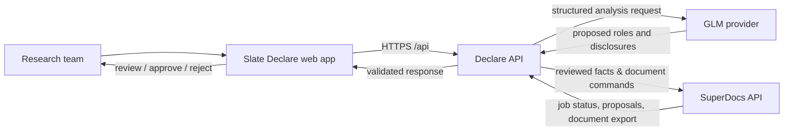
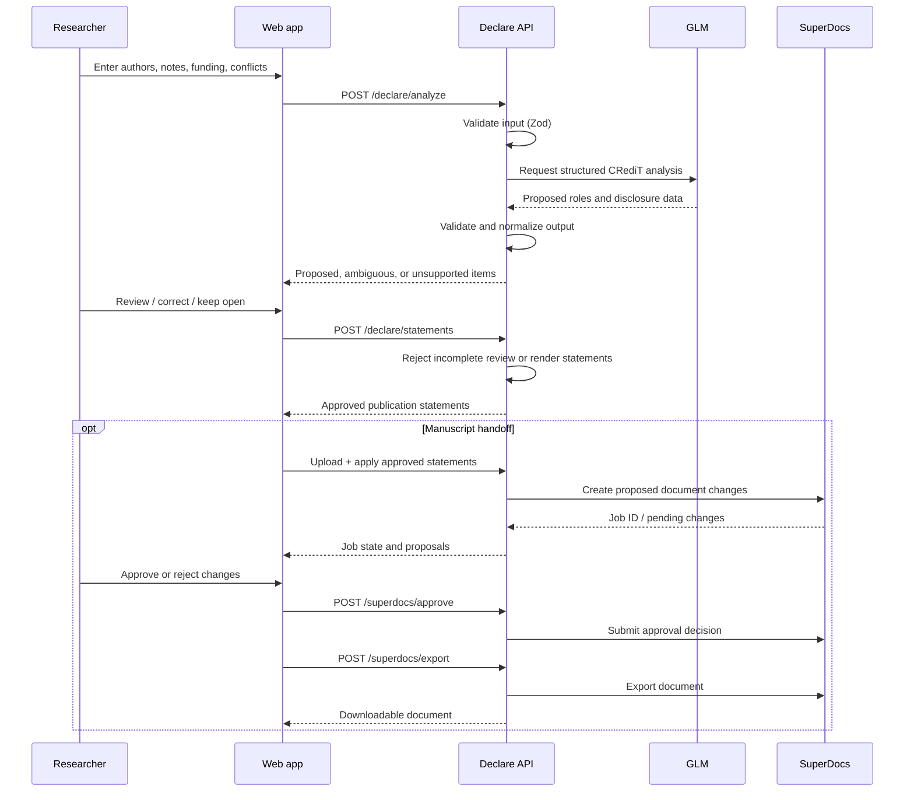
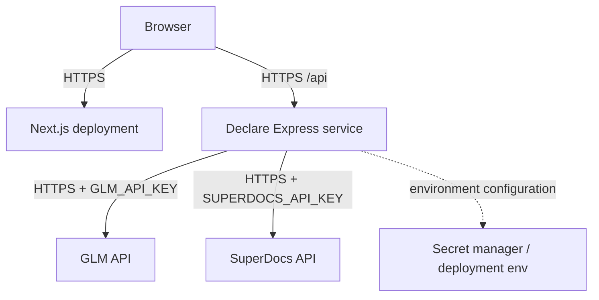

# Slate Declare — High-Level Design

## 1. Purpose

Slate Declare is a research-authorship workflow that converts team-provided notes into a **reviewable record** of CRediT contributions, funding, and conflict disclosures. It then renders publication-ready statements and can hand those statements to SuperDocs as a proposed manuscript edit.

The central design principle is simple: **AI may propose; researchers approve.** The system never treats model output as final publication text without a review gate.

## 2. Goals and non-goals

| Goals | Non-goals |
| --- | --- |
| Structure unstructured contribution notes into the CRediT vocabulary. | Decide authorship eligibility or author order. |
| Preserve ambiguity and route it to human review. | Replace institutional authorship policy or ethics review. |
| Produce deterministic statements from approved facts. | Write unreviewed claims directly into a manuscript. |
| Provide an auditable handoff to a document-editing service. | Store, version, or publish research manuscripts itself. |

## 3. System context



External systems are behind the API boundary. Browser code never receives provider keys and does not call GLM or SuperDocs directly.

## 4. Components and responsibilities

| Component | Location | Responsibilities |
| --- | --- | --- |
| Next.js web app | `apps/web` | Provides the landing page and multi-stage Declare workspace; owns client interaction state and job polling. |
| API client | `apps/web/lib/declare-api.ts` | Converts user actions into API requests and normalizes browser-side failure handling. |
| Express API | `apps/server/declare/src` | Exposes HTTP routes, validates requests, enforces review gates, and maps provider failures to stable responses. |
| Schema layer | `apps/server/declare/src/schema` | Defines Zod contracts for inputs and provider-shaped data. |
| GLM adapter | `apps/server/declare/src/llm/glm.ts` | Sends deterministic (`temperature: 0`) structured-output analysis requests and parses the response. |
| Review utilities | `apps/server/declare/src/utils/review.utils.ts` | Ensures facts are sufficiently reviewed before statement generation or document application. |
| Statement utilities | `apps/server/declare/src/utils/statement.utils.ts` | Deterministically turns approved facts into contribution, funding, and conflict statements. |
| SuperDocs adapter | `apps/server/declare/src/utils/superdocs.utils.ts` | Uploads, applies, approves/rejects, checks, and exports manuscript changes. |
| Shared UI package | `packages/ui` | Supplies shared UI primitives and global styles. |

## 5. Primary workflow



## 6. Trust boundaries and review gates

The system contains three distinct fact states:

1. **Input** — author names and free-text notes supplied by the research team.
2. **Proposal** — GLM’s structured interpretation of those notes, including proposed, ambiguous, or unsupported contribution mappings.
3. **Approved facts** — the researcher-reviewed record used to render final statements and request manuscript edits.

The API checks the approved record before either of these irreversible-looking outputs is requested:

- `POST /api/declare/statements`
- `POST /api/superdocs/apply`

If review requirements are not met, the API returns `422 REVIEW_REQUIRED`. This keeps the approval gate server-side rather than relying only on browser behavior.

## 7. Data model

The current workflow is request-scoped: the browser holds working state while the external document provider owns its document session. The database package and Prisma schema are present for future persistence, but Declare’s main path does not currently write an application-owned record.

```text
DeclareFacts
├── authors[]
│   ├── id
│   └── name
├── contributions[]
│   ├── authorId
│   ├── evidence
│   ├── roleIds[]       # valid CRediT role identifiers
│   └── status          # approved | ambiguous
├── funding
│   ├── status          # reported | none | unknown
│   ├── funder?
│   ├── awardNumber?
│   └── evidence
└── conflicts
    ├── status          # reported | none | unknown
    └── items[]         # author, disclosure, and evidence where available
```

The deliberate separation of contributions, funding, and conflicts avoids treating financial disclosures as contributor roles.

## 8. API design

The API is versioned by its `/api` mount point and returns a consistent envelope for JSON responses:

```ts
type ApiSuccess<T> = {
  success: true;
  data: T;
  error: null;
};

type ApiFailure = {
  success: false;
  message: string | null;
  error: string;
  issues?: unknown[];
};
```

`POST /api/superdocs/export` is the exception when SuperDocs returns a binary document: the API streams the provider’s content type and bytes directly to the browser.

### Error policy

| Status | Meaning | Example |
| --- | --- | --- |
| `400` | Request or provider-shaped data failed validation. | Missing authors or malformed payload. |
| `413` | Uploaded document exceeds the JSON body size limit. | Large base64 manuscript upload. |
| `422` | Researcher review is incomplete. | Ambiguous contribution remains open. |
| `502` | An upstream provider request failed. | GLM or SuperDocs error/timeout. |
| `503` | A required provider key is not configured. | `GLM_API_KEY` or `SUPERDOCS_API_KEY` absent. |

## 9. Deployment view



The web and API can be deployed independently. In non-local environments, configure `NEXT_PUBLIC_DECLARE_API_URL` to the public API base URL and update the API CORS allow-list to the deployed web origin. Store provider keys only in the API service’s environment or a secret manager.

## 10. Reliability and operational notes

- Provider calls use `AbortSignal.timeout`; GLM and SuperDocs timeout values are configurable.
- Document jobs are asynchronous. The web app polls job status every four seconds while a job is queued or processing and surfaces a delayed state after 90 seconds.
- API request bodies are capped at 32 MB to support base64 manuscript transfer while providing a bounded upload size.
- Statement rendering is local and deterministic once facts are approved; it does not make a second model call.
- Current CORS configuration allows the local web origin. Production deployments must explicitly configure the production origin.

## 11. Security and privacy considerations

- Treat contribution notes, author names, funding details, conflicts, and manuscripts as sensitive research information.
- Keep `GLM_API_KEY` and `SUPERDOCS_API_KEY` server-only. Do not expose them through `NEXT_PUBLIC_*` variables.
- The current API has no application authentication or durable audit store. Before exposing it beyond a trusted environment, add identity, authorization, rate limits, request logging/redaction, and an approved-facts audit trail.
- Review the GLM and SuperDocs data-processing terms before sending confidential or unpublished material to either provider.

## 12. Extension path

The architecture is intentionally modular. Natural next steps are:

1. Persist projects, review history, and approvals in the database package.
2. Add authenticated workspaces and role-based review permissions.
3. Capture an immutable, exportable audit log of input, proposal, edits, approval, and document job metadata.
4. Add webhook-based SuperDocs job updates to reduce browser polling.
5. Make provider adapters configurable so model or document services can be swapped without changing the web contract.

## 13. Design decisions

| Decision | Rationale |
| --- | --- |
| Model proposes structured facts, not final text | It narrows the model’s role and makes uncertainty reviewable. |
| Deterministic renderer for final statements | Prevents a second generative step from changing researcher-approved facts. |
| Server-side review validation | Ensures clients cannot bypass the intended review gate. |
| SuperDocs edits remain proposals | Preserves researcher authority over the manuscript. |
| Provider adapters behind the API | Keeps secrets out of the browser and isolates integration-specific behavior. |
