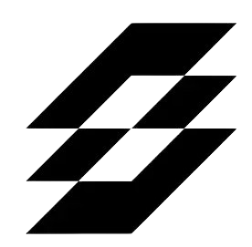

<p align="center">
  
</p>

<h1 align="center">Slate Declare</h1>

<p align="center">
  <strong>Clear, researcher-approved authorship statements—before they reach a manuscript.</strong>
</p>

<p align="center">
  A focused workspace for turning contribution notes into reviewed CRediT roles, funding disclosures, and conflict-of-interest statements.
</p>

---

## Why Declare

Research contributions are often recorded as rough notes, scattered messages, or incomplete memories. Declare gives teams a deliberate review step between those notes and publication-ready language.

It helps teams:

- map described work to the 14 standard CRediT contributor roles;
- keep unclear work visible instead of forcing a role assignment;
- review funding and conflict disclosures separately from contribution roles;
- generate deterministic statements only after the underlying facts are approved; and
- propose approved statements in a manuscript through SuperDocs, where changes can still be accepted or rejected.

Declare supports authorship documentation. It does not decide who qualifies as an author.

## Experience

```text
Authors + contribution notes
            │
            ▼
     Analyze & propose roles
            │
            ▼
  Researcher review and correction
            │
            ▼
  Publication-ready statements
            │
            ▼
  Optional SuperDocs manuscript proposal → approve/reject → export
```

## Architecture at a glance

| Layer | Technology | Responsibility |
| --- | --- | --- |
| Web app | Next.js 16, React 19, Tailwind CSS | Collect inputs, guide review, display statements, and manage manuscript handoff. |
| API | Express 5, Bun, Zod | Validate requests, coordinate providers, enforce review gates, and return stable API responses. |
| Analysis provider | GLM-compatible chat completions API | Propose structured CRediT mappings from contributor notes. |
| Document provider | SuperDocs API | Upload documents, prepare manuscript changes, accept/reject changes, and export documents. |
| Shared UI | Workspace package | Reusable UI primitives and styling. |

For the complete system design, data flow, API boundaries, and operational considerations, read [DESIGN.md](./DESIGN.md).

## Repository layout

```text
.
├── apps/
│   ├── web/                  # Next.js user experience
│   │   ├── app/              # Routes, layout, metadata, Slate favicon
│   │   ├── components/       # Landing page and Declare workspace
│   │   └── lib/              # Browser API client
│   └── server/declare/       # Express API for analysis and document handoff
│       ├── src/controllers/  # HTTP orchestration
│       ├── src/schema/       # Zod input/output contracts
│       ├── src/utils/        # Review, statement, and provider helpers
│       └── src/llm/          # GLM adapter
├── packages/
│   ├── ui/                   # Shared components and global styles
│   ├── database/             # Database package and Prisma schema
│   └── */                    # Shared TypeScript and ESLint configuration
├── DESIGN.md                 # High-level design
└── turbo.json                # Task orchestration
```

## Getting started

### Prerequisites

- [Bun](https://bun.sh/) 1.2.22 or later
- Node.js 20 or later (for tooling compatibility)
- A GLM-compatible API key for role analysis
- A SuperDocs API key for manuscript upload, review, and export

### Install

```bash
bun install
```

### Configure the API

Create `apps/server/declare/.env` and add the provider credentials you need:

```bash
# Required to analyze contributor notes with GLM
GLM_API_KEY=your_glm_api_key

# Required only for manuscript handoff through SuperDocs
SUPERDOCS_API_KEY=your_superdocs_api_key

# Optional defaults
PORT=8000
GLM_BASE_URL=https://api.z.ai/api/paas/v4
GLM_MODEL=glm-5.3
NEXT_PUBLIC_DECLARE_API_URL=http://localhost:8000/api
```

`NEXT_PUBLIC_DECLARE_API_URL` belongs in `apps/web/.env.local` when the web app needs a non-default API URL. The API defaults to `http://localhost:8000/api` in local development.

### Run locally

Start the Declare API in one terminal:

```bash
cd apps/server/declare
bun run dev
```

Start the web app in another:

```bash
cd apps/web
bun run dev
```

Open [http://localhost:3000](http://localhost:3000).

## Available commands

Run these from the repository root unless noted otherwise.

| Command | What it does |
| --- | --- |
| `bun run dev` | Starts workspace development tasks through Turborepo. |
| `bun run build` | Builds all configured workspace packages. |
| `bun run lint` | Runs workspace lint tasks. |
| `bun run typecheck` | Runs workspace TypeScript checks. |
| `cd apps/web && bun run dev` | Starts only the Next.js app. |
| `cd apps/server/declare && bun run dev` | Starts only the Express API. |
| `cd apps/server/declare && bun test` | Runs the Declare API tests. |

## API surface

All API routes are served under `/api` by the Declare server.

| Method | Path | Purpose |
| --- | --- | --- |
| `GET` | `/health` | Service health check. |
| `POST` | `/api/declare/analyze` | Propose CRediT roles, funding, and conflict data from team notes. |
| `POST` | `/api/declare/statements` | Generate publication statements from reviewed facts. |
| `POST` | `/api/superdocs/upload` | Upload a manuscript for the document workflow. |
| `POST` | `/api/superdocs/apply` | Request proposed manuscript edits from approved facts. |
| `GET` | `/api/superdocs/jobs/:jobId` | Retrieve document-job status. |
| `POST` | `/api/superdocs/approve` | Accept or reject proposed manuscript changes. |
| `POST` | `/api/superdocs/export` | Export the resulting document. |

The API uses Zod at its boundary. Invalid input returns `400`; requests that need researcher review return `422`; unavailable external providers return `503`; provider failures are surfaced as `502`.

## Product guardrails

- **No silent certainty:** ambiguous evidence remains reviewable rather than receiving a guessed role.
- **Reviewed facts first:** final contribution, funding, and conflict language is produced from the reviewed record.
- **Human approval stays in control:** document edits are proposed through SuperDocs and can be approved or rejected before export.
- **Separation of concerns:** authorship roles, funding, and conflicts are independently represented and reviewed.

## Visual identity

The browser icon is Slate’s `slate.png` asset at [`apps/web/public/icons/slate.png`](./apps/web/public/icons/slate.png). The README uses the matching [`slateicon.png`](./apps/web/public/icons/slateicon.png) alias. Next.js metadata explicitly declares the Slate PNG icon, replacing the previous default favicon.

## Contributing

Keep changes focused, validate inputs at service boundaries, and add or update tests when changing analysis, review, statement, or document workflow behavior. Before opening a change, run the relevant package checks and test suite.

---

Built by Slate for research teams that want a clearer record of who did what.
